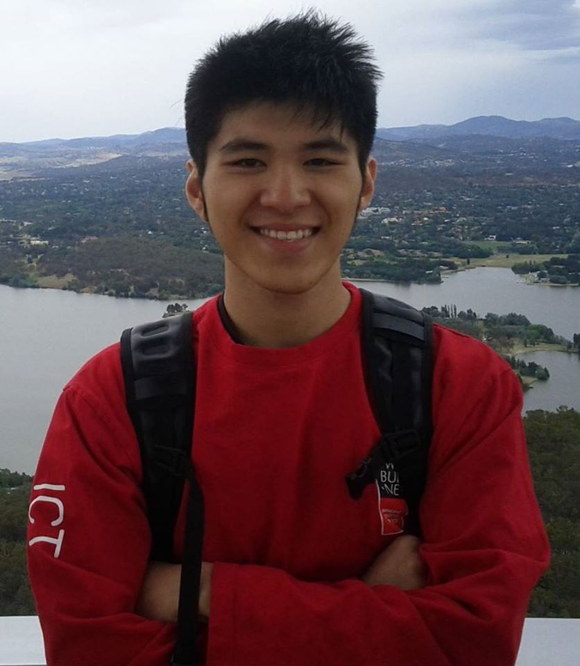

## About me
Duong Nhu's project focuses on automated epilepsy monitoring of short and long term EEG recordings, and wearable devices under the GRIP scholarship. Duong Nhu's supervisors are Dr. Levin Kuhlmann, Professor Patrick Kwan, Dr. Chang Wei Tan, and Dr. Amanda Gilligan. Duong has been awarded the MIME research funding, and the most outstanding poster presentation at the 1st Monash Young MedTech Innovators Symposium.

## Contact details
Email: [d.binhnhu@gmail.com](d.binhnhu@gmail.com), [duong.nhu1@monash.edu](duong.nhu1@monash.edu)

Linkedin: [https://www.linkedin.com/in/duongbinhnhu/](https://www.linkedin.com/in/duongbinhnhu/)

Research Gate: [https://www.researchgate.net/profile/Duong-Binh-Nhu](https://www.researchgate.net/profile/Duong-Binh-Nhu)

## Publications

1. D. Nhu and C. Chua, “Preprocessing Code Example For Searching,” in Proceedings of the ASWEC 2015 24th Australasian Software Engineering Conference, New York, NY, USA, Sep. 2015, pp. 28–32, doi: [10.1145/2811681.2811687](10.1145/2811681.2811687).
2. D. Nhu et al., “Automated Inter-ictal Epileptiform Discharge Detection From Routine EEG,” presented at the Digital Health Institute Summit 2020, [https://www.researchgate.net/publication/351022175_Automated_Inter-ictal_Epileptiform_Discharge_Detection_From_Routine_EEG](https://www.researchgate.net/publication/351022175_Automated_Inter-ictal_Epileptiform_Discharge_Detection_From_Routine_EEG)
3. Nhu, D., Janmohamed, M., Shakhatreh, L., Gonen, O., Kwan, P., Gilligan, A., Tan, C.W., Kuhlmann, L. Automated Detection of Generalized Epileptiform Discharges in Routine EEG: A Multicenter Study, American Epilepst Society Annual Meeting (2020), [https://cms.aesnet.org/abstractslisting/automated-detection-of-generalized-epileptiform-discharges-in-routine-eeg--a-multicenter-study](https://cms.aesnet.org/abstractslisting/automated-detection-of-generalized-epileptiform-discharges-in-routine-eeg--a-multicenter-study)

## Awards

1. Monash Institute of Medical Engineering (MIME), Monash Partners and CSIRO sponsored PhD research support program, 2019.
2. The most outstanding poster presentation at the 1st Monash Young MedTech Innovators Symposium 2019.
3. 1st place - 2016 ITS Mastercard Smart City Hack Future City Challenge
4. 3rd in Melbourne Data Science Hackathon 2015. [Video](http://www.datasciencemelbourne.com/datathon/2016videos/)
5. Swiburne Venture Cup 2015 - Runner up. [Article](http://knowing.swinburne.edu.au/post/134764024184/wrap-of-the-swinburne-venture-cup)

